##  1.Python × GCPで音声の文章化を体験してみよう！

#### 目的

1. Google Cloudが提供するAPIを使えるようにする。
2. PyaudioとCloud Speech-to-text APIを使って録音・議事録への書き起こしができるようにする。

#### ゴール

ローカル上でプログラムを起動して、音声をテキストに出力してみよう！


### 構成図

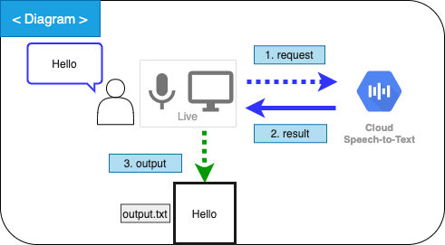


### 使用技術

- Python 3.6.3
- GCP : Cloud Speech-to-TextAPI


### 前提条件

- Pythonがインストールされている(ver3.5~)
- GoogleAccountを取得している
- GCPにログイン出来る


## 2. まだPyhton3のインストールが完了していない方のために


あとから[Google Cloud SDK](https://cloud.google.com/sdk/docs/quickstart?hl=ja)をインストールする際に必要になりますので、
以下のリンクを参考に各OSでインストールして下さい。
[Python環境構築ガイド](https://www.python.jp/install/install.html)
※Windows環境の方は[Chocolatey](https://chocolatey.org/install#installing-chocolatey)を推奨します。
なお、ChocolateyでPythonをインストールする際は以下のコマンドを使用します。


```shell
# Pythonのインストール
$ choco install python
# Version指定時
$ choco install -y python --version=3.6.3
# pipのインストール
$ pip install --upgrade pip
```


## 3.GCP上でプロジェクトを作成

1. [GCP](https://console.cloud.google.com/?hl=ja&pli=1)にログインして、「プロジェクトを作成」を選択します。


2. プロジェクト名を設定します。
    ※場所に関しては「組織なし」のままにしておきます。
    設定したら、作成を押しましょう。
    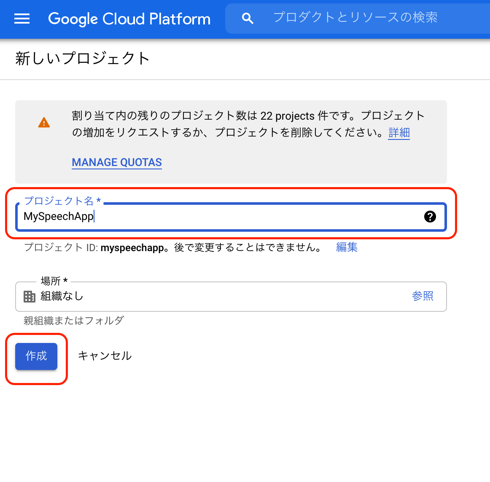

3. 無事作成されたら作成したプロジェクト名のダッシュボードに画面遷移していると思います。
左上のナビゲーションメニューから「APIとサービス」→「ダッシュボード」へ移動します。
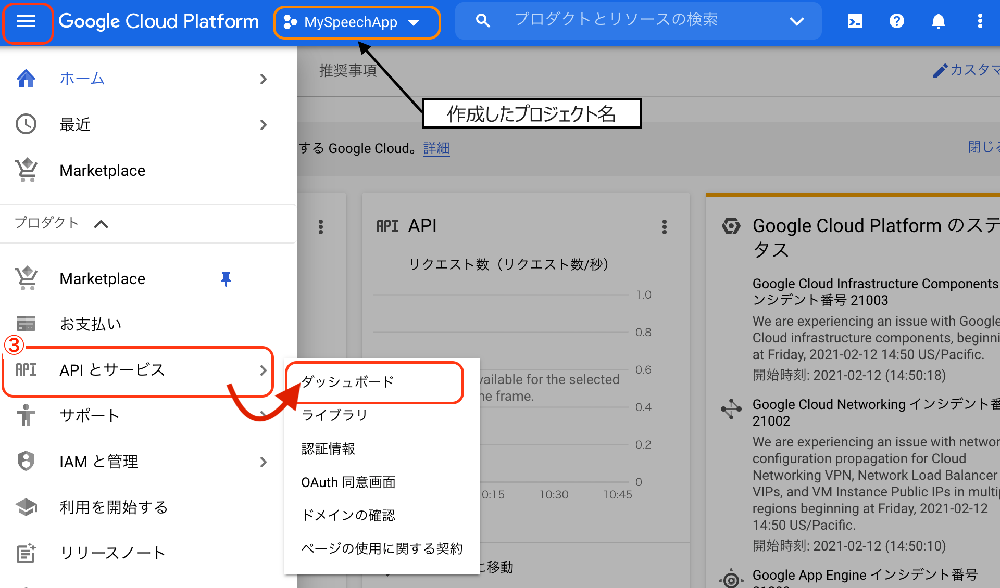


4. APIとサービスのダッシュボードへ移動したら「＋APIとサービスの有効化」を選択します。
   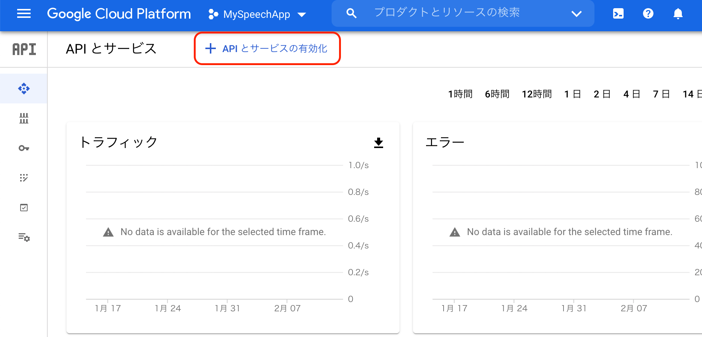

5. 「APIライブラリ」という画面になり、APIを選択出来る画面になりますので、
   検索バーに `Cloud Speech-to-Text API`と入力すれば検索にひっかかります。
   
   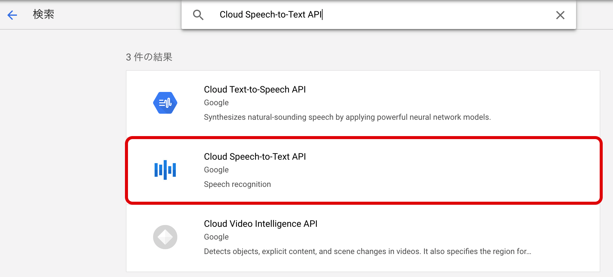

6. APIを選択すると、詳細画面に移ります。ここで「有効にする」を選択します。
   ほどなくして、「概要」の画面に切り替わります。
   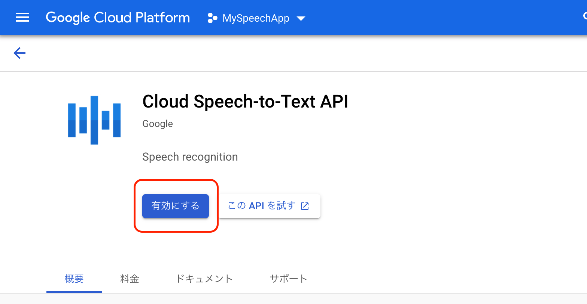
7. 「有効化のステータス」が`有効`　になっていればAPI自体は使える様になっています。
   しかし、画面上に表示されているように認証情報が必要になりますので、「認証情報を作成」
   を選択します。
   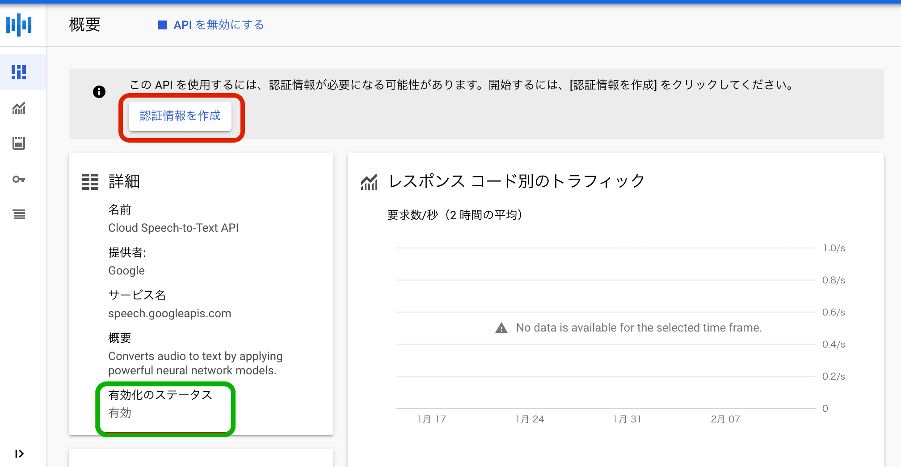
8. 「認証情報」画面に切り替わります。ここで使用するAPIを選択します。
   もちろん、`Cloud Speech-to-Text API`を選択します。
   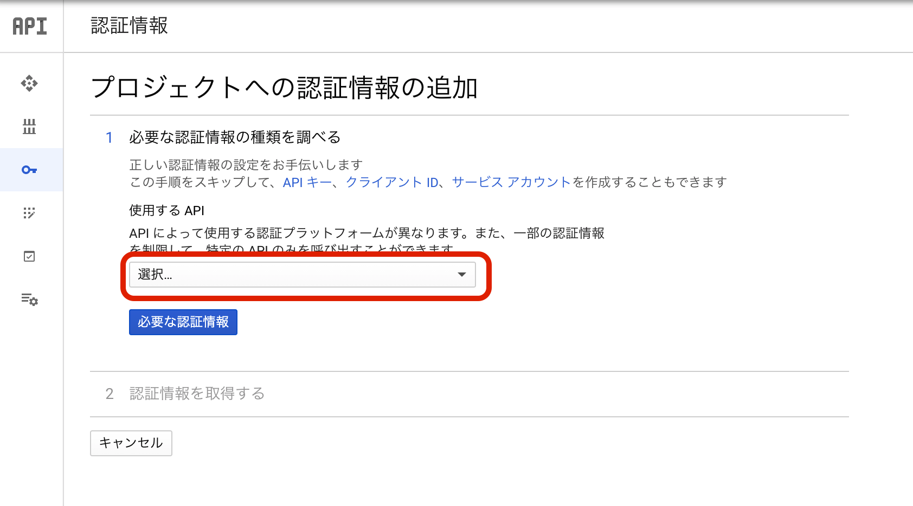
9. 次の「App Engine または Compute EngineでこのAPIを使用する予定はありますか？」という選択に対しては、今回の取り組みではインスタンスを使う予定はないので「いいえ、使用していません」を選択し、その下の「必要な認証情報」を選択します。
   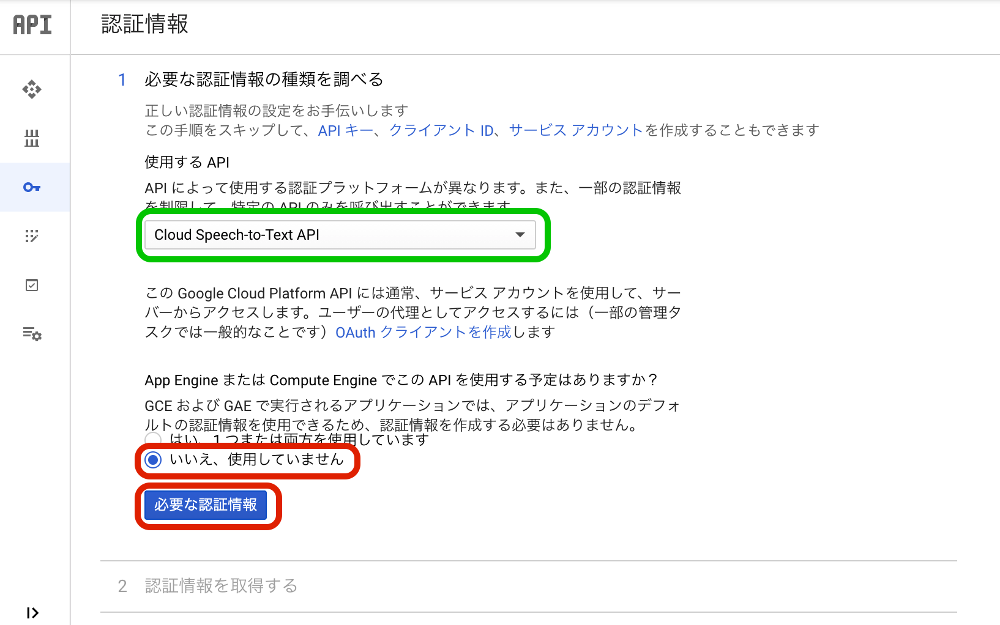
10. サービスアカウントを作成します。
    サービスアカウント名を入力（お好きな名前を入力してください）します。
    ※サービスアカウント名を入力すると、「サービスアカウントID」には自動で入力されます。
    その次はロールを選択します。
    ロールに関しては、今回は「オーナー」を選択します。本来は閲覧者や編集者などの権限に沿って設定して下さい。
    キーのタイプは「JSON」を選択し、「次へ」を押すとサービスアカウントが作成され、キーがDL出来ます。
    なお、このJSONファイルは後の作業で使用します。DL後は作業ディレクトリに移動させておきましょう。
    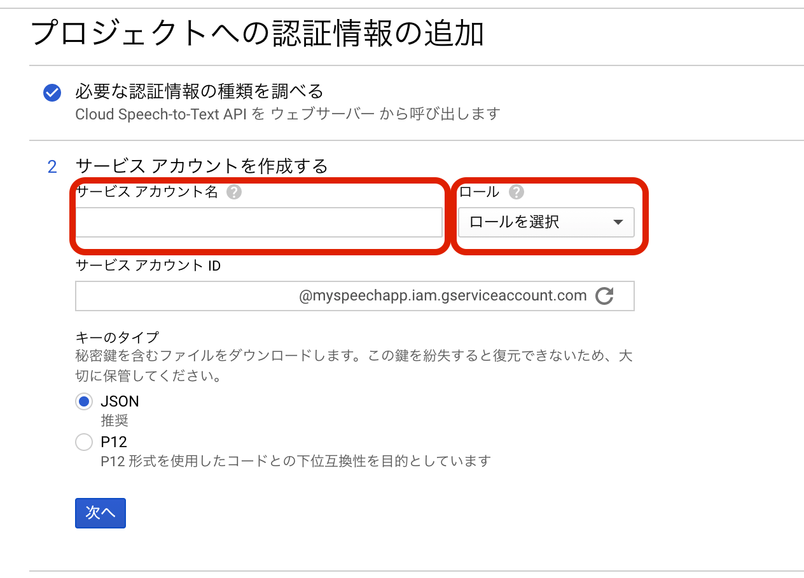
    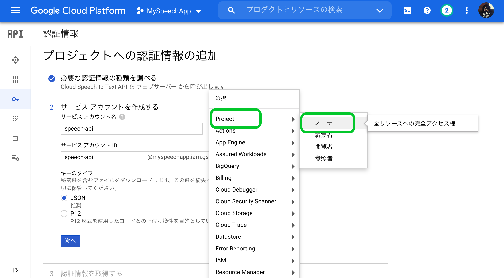
    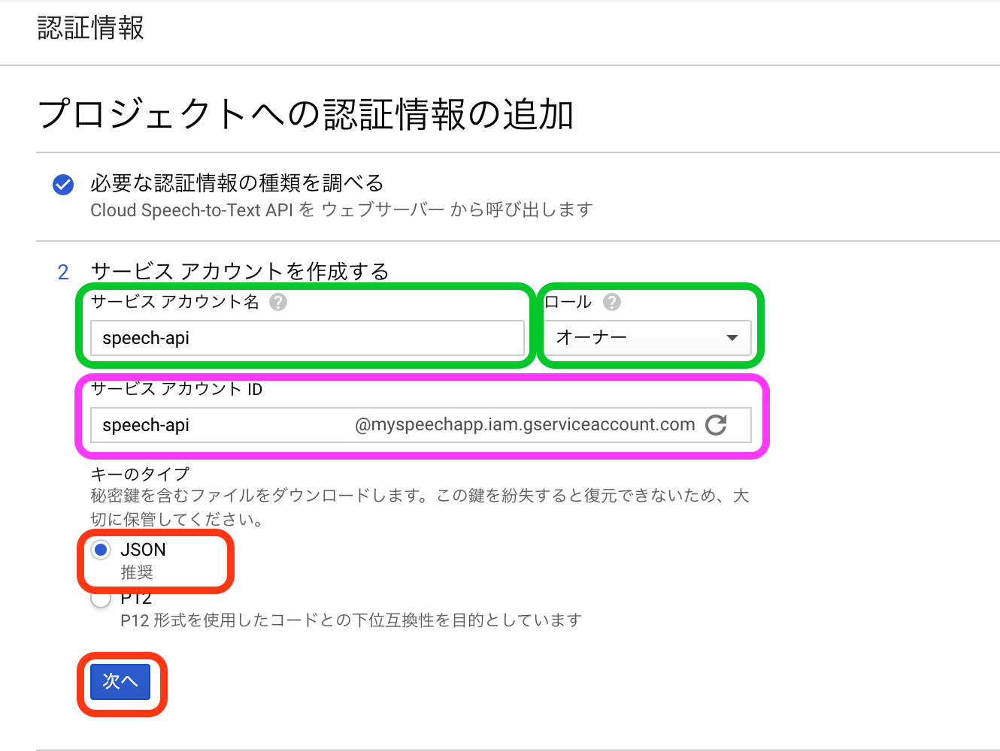
    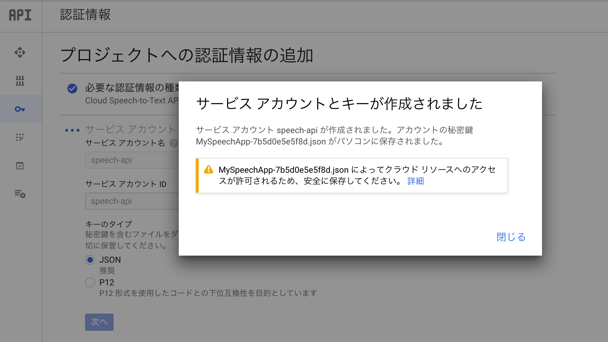
11. 認証情報の画面に切り替わると、サービスアカウントに追加されていることが確認出来ます。
    GCP上で設定する内容はここまでです。
    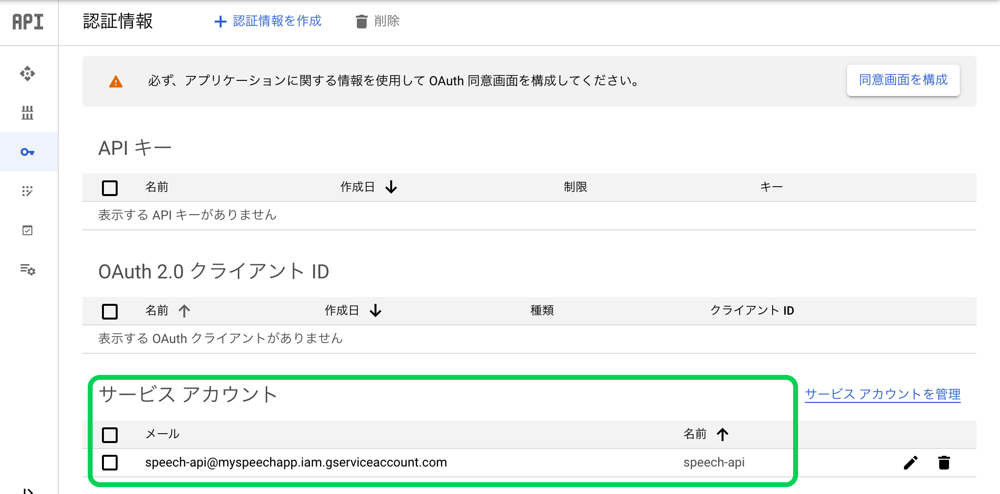


## 4. Google Cloud SDKのインストール

Macの方は[Google Cloud SDK](https://cloud.google.com/sdk/docs/quickstart?hl=ja)をインストールします。

パッケージのtarファイルをDL出来たら解凍します。
```shell
$ tar -xvf {DLしたtar.gzまでのパス}
```
例）
```shell
$ tar -xvf ./Downloads/google-cloud-sdk-324.0.0-darwin-x86_64.tar.gz
```

解凍されたら`google-cloud-sdk`が作成されているため、以下のコマンドでスクリプトを実行します。
```shell
$ ./google-cloud-sdk/install.sh
```

Windowsでは同インストーラーがDL出来るのでそちらの手順に従って設定してください。

※既にインストールされている方はSDKを初期化してください。初期化の方法は以下をリンクを確認して下さい。
[Cloud SDK の初期化](https://cloud.google.com/sdk/docs/initializing?hl=ja)


設定内容としては、
1.) ログイン認証の確認をされるので「Y」と入力して下さい。

```shell
# ここは「Y」と入力してください
You must log in to continue. Would you like to log in (Y/n)?
```

2.) ブラウザが勝手に開くので、プロジェクトを作成したGoogleAccountで認証します。
3.) ターミナル（PowerShell,cmd）に、2で選択したアカウントで使用しているプロジェクトが表示されます。番号のプロジェクトを選択すると設定が完了するので、先ほど作成したプロジェクトに割り当てられている番号を選択します。

```shell
# この場合は1を入力しています
Pick cloud project to use:
 [1] MySpeechApp-xxxx
 [2] hogehoge-xxxxx
 [3] Create a new project
Please enter numeric choice or text value (must exactly match list
item):  1
```


## 5. 仮想環境作成

Pythonを使って開発や実験を行うときは、用途に応じて専用の実行環境を作成し、切り替えて使用するのが一般的です。
主に、システム全体で使うPython環境に影響を与えずにモジュールの追加・入れ替えをしたり、異なるバージョンの Python を使いわけたり、同じモジュールの、複数のバージョンを使い分けたりすることが出来るメリットがあります。

まずは作業するディレクトリを作成します。

作成後にそのディレクトリ内でターミナル（コマンドプロンプト、PowerShell）を開いて、以下のコマンドを実行することで仮想環境を用意します。

1.) 仮想環境を作成
■Mac

```Python
$ python3 -m venv venv
```
■Windows
```Python
$ python -m venv venv
```
上記を実行すると現在の作業ディレクトリにvenvというディレクトリが作成されていると思います。このディレクトリが作成されているのを確認できたら次のコマンドを実行します。

2.) 仮想環境に切り替える
■Mac
```Python
$ . venv/bin/activate
```
■Windows
```Python
$ .\venv\Scripts\activate
```
このコマンドを実行すると、ターミナル（コマンドプロンプト、Powershell）上で以下の画像のようになっていると思います。
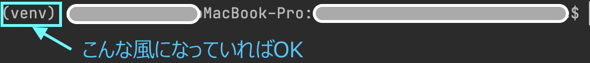


## 6. Credentialsを環境変数に設定する
環境変数　`GOOGLE_APPLICATION_CREDENTIALS` に先程DLしたキー（JSONファイル）迄のファイルパスをセットします。
これは、Cloud SDKでサービスアカウントを使用するには、コードを実行する環境変数を設定する必要があるためです。
環境変数（GOOGLE_APPLICATION_CREDENTIALS）を設定して、アプリケーションコードに認証情報を指定します。
DL後に作業ディレクトリにファイルを移動させていなければこのタイミングで移動させておきましょう。
[こちら](https://cloud.google.com/docs/authentication/getting-started#windows)を参照してください。

作業ディレクトリでターミナル（コマンドプロンプト、Powershell）を開いて以下のコマンドでクリップボードへコピーします。

- Mac(ターミナル)の場合
```shell
$ find $PWD -maxdepth 1 -name "*.json" | pbcopy
```

- Windows（Powershell）の場合①
```shell
$ (Get-ChildItem .\*.json).FullName | Set-Clipboard
```

- Windows（コマンドプロンプト）の場合②
```shell
$ for %a in (%CD%\\*.json) do (echo %a) | clip
```

クリップボードにコピーされているはずなのでそれを以下の手順で環境変数へ設定する。

- Mac
```shell
# 環境変数に設定
# {}は入力不要です。貼り付けの際はダブルクオーテーションで囲って下さい。
$ export GOOGLE_APPLICATION_CREDENTIALS={ここで貼り付け}
#　参考例
$ export GOOGLE_APPLICATION_CREDENTIALS="Users/develop/pyaudio/hogehoge.json"
# 確認(ファイルパスが返ってくればOK)
$ echo $GOOGLE_APPLICATION_CREDENTIALS
```

- Windows
```shell
# PowerShell を使用する場合:
$ $env:GOOGLE_APPLICATION_CREDENTIALS="{ここで貼り付け}"
# 参考例
$ $env:GOOGLE_APPLICATION_CREDENTIALS="C:\Users\develop\pyaudio\hogehoge.json"
# 確認(ファイルパスが返ってくればOK)
$ $env:GOOGLE_APPLICATION_CREDENTIALS
```

```shell
# コマンド プロンプトを使用する場合:
$ set GOOGLE_APPLICATION_CREDENTIALS={DLしたjsonファイルまでのパス}
# 確認(環境変数に設定されているか確認)
$ set
```


## 7. パッケージをインストール

必要なパッケージをインストールします。
音声を文字起こしする際に必要なパッケージと、前述のGoogleのAPIを使うためにこちらのパッケージが必要になります。

```python
# pipのインストール
$ pip install --upgrade pip
# パッケージ類
$ pip install google-cloud-speech pyaudio
```
※WindowsでVer3.7〜で実行する際は前述の[設定方法](https://zenn.dev/daisukesasaki/articles/fd0cafe486c934#pyaudio%E3%81%AB%E3%81%A4%E3%81%84%E3%81%A6%E3%81%A1%E3%82%87%E3%81%A3%E3%81%A8%E8%A3%9C%E8%B6%B3%EF%BC%88windows%E3%81%A7%E3%81%AE%E3%81%BF%E7%A2%BA%E8%AA%8D%EF%BC%89)
を参考にして、以下のコマンドを実行して下さい。

```python
pip install .\PyAudio-0.2.11-cp37-cp37m-win_amd64.whl
```


## 注) pyaudioについて（Windows環境）

資料についてはPythonはver3.6.x~を想定しますが、どうしてもVer3.7~で行う必要がある際はこちらを参考にして下さい。

■なぜこの作業が必要？
pyaudio上で、「portaudio.h」というライブラリが必要になるがこれは完全に独立した、
C言語のライブラリとなっています。[portaudio.hについてはこちら](http://portaudio.com/docs/v19-doxydocs/)
これがWindowsでのPythonのVer3.7~用にビルドされておらず、システムがコンパイルに失敗しているため、インストール時にエラーが発生する。というのが原因になります。

そのため、PythonのVerに応じたビルド済のWindows用バイナリとなるwhlファイルを別途入手する必要があります。
whlファイルを入手し、後述のコマンドを使用してpip install することで要件を満たす事が出来ます。

■PyAudioの依存関係の不具合の解消
Ver3.7以降だとpyaudioのインストール時にverに沿ったwhlファイルをDLする必要があります。そのため、インストール前に[このリンク](https://www.lfd.uci.edu/~gohlke/pythonlibs/#pyaudio)からwhlファイルをDLして下さい。

■whlファイルの選択の仕方

1. リンク先に画面遷移したらPyAudioを探し、所定のバージョンを選択します。
   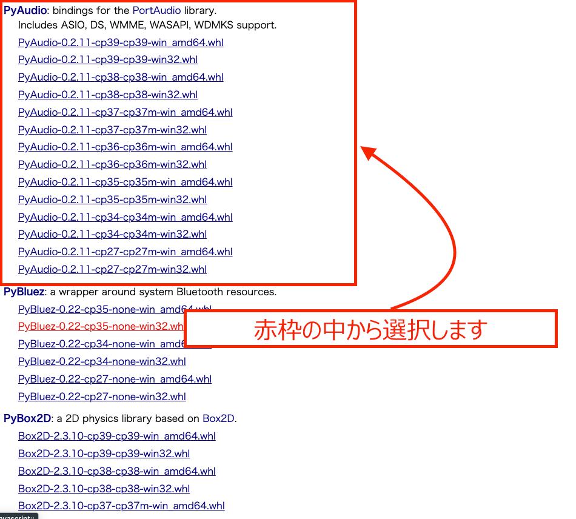

2. バージョンごとのwhlファイルの選択の仕方としては以下のように読み取って選択します。
   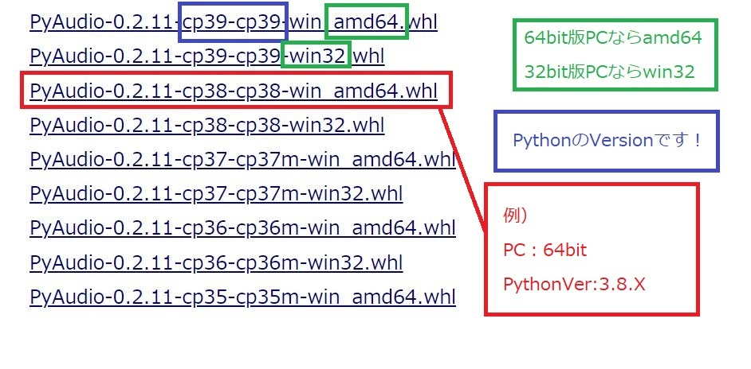

3. DL後は現在の作業ディレクトリにwhlファイルを置いて以下のコマンドを実行して下さい。
   （基本的には任意の場所で結構です）

```python
pip install .\PyAudio-0.2.11-cp37-cp37m-win_amd64.whl
```


## 8. サンプルコードでの実装

```手順
1.) https://github.com/googleapis/python-speech/blob/master/samples/microphone/transcribe_streaming_infinite.py
   ↑に記載のコードをコピー

2.) https://note.com/npaka/n/n7214f0607a40
   ↑手順を参考に、部分的に修正

3.) 作業フォルダにoutputフォルダを作成する

```実行方法
python speech.py

```python
#!/usr/bin/env python

# Copyright 2019 Google LLC
#
# Licensed under the Apache License, Version 2.0 (the "License");
# you may not use this file except in compliance with the License.
# You may obtain a copy of the License at
#
#      http://www.apache.org/licenses/LICENSE-2.0
#
# Unless required by applicable law or agreed to in writing, software
# distributed under the License is distributed on an "AS IS" BASIS,
# WITHOUT WARRANTIES OR CONDITIONS OF ANY KIND, either express or implied.
# See the License for the specific language governing permissions and
# limitations under the License.

"""Google Cloud Speech API sample application using the streaming API.
NOTE: This module requires the dependencies `pyaudio` and `termcolor`.
To install using pip:
    pip install pyaudio
    pip install termcolor
Example usage:
    python transcribe_streaming_infinite.py
"""

# [START speech_transcribe_infinite_streaming]

import re
import sys
import time

from google.cloud import speech
import pyaudio
from six.moves import queue

import datetime
now = datetime.datetime.now()
FILE_NAME = './output/log_' + now.strftime('%Y%m%d_%H%M%S') + '.txt'

# Audio recording parameters
STREAMING_LIMIT = 240000  # 4 minutes
SAMPLE_RATE = 16000
CHUNK_SIZE = int(SAMPLE_RATE / 10)  # 100ms

RED = "\033[0;31m"
GREEN = "\033[0;32m"
YELLOW = "\033[0;33m"


def get_current_time():
    """Return Current Time in MS."""

    return int(round(time.time() * 1000))


class ResumableMicrophoneStream:
    """Opens a recording stream as a generator yielding the audio chunks."""

    def __init__(self, rate, chunk_size):
        self._rate = rate
        self.chunk_size = chunk_size
        self._num_channels = 1
        self._buff = queue.Queue()
        self.closed = True
        self.start_time = get_current_time()
        self.restart_counter = 0
        self.audio_input = []
        self.last_audio_input = []
        self.result_end_time = 0
        self.is_final_end_time = 0
        self.final_request_end_time = 0
        self.bridging_offset = 0
        self.last_transcript_was_final = False
        self.new_stream = True
        self._audio_interface = pyaudio.PyAudio()
        self._audio_stream = self._audio_interface.open(
            format=pyaudio.paInt16,
            channels=self._num_channels,
            rate=self._rate,
            input=True,
            frames_per_buffer=self.chunk_size,
            # Run the audio stream asynchronously to fill the buffer object.
            # This is necessary so that the input device's buffer doesn't
            # overflow while the calling thread makes network requests, etc.
            stream_callback=self._fill_buffer,
        )

    def __enter__(self):

        self.closed = False
        return self

    def __exit__(self, type, value, traceback):

        self._audio_stream.stop_stream()
        self._audio_stream.close()
        self.closed = True
        # Signal the generator to terminate so that the client's
        # streaming_recognize method will not block the process termination.
        self._buff.put(None)
        self._audio_interface.terminate()

    def _fill_buffer(self, in_data, *args, **kwargs):
        """Continuously collect data from the audio stream, into the buffer."""

        self._buff.put(in_data)
        return None, pyaudio.paContinue

    def generator(self):
        """Stream Audio from microphone to API and to local buffer"""

        while not self.closed:
            data = []

            if self.new_stream and self.last_audio_input:

                chunk_time = STREAMING_LIMIT / len(self.last_audio_input)

                if chunk_time != 0:

                    if self.bridging_offset < 0:
                        self.bridging_offset = 0

                    if self.bridging_offset > self.final_request_end_time:
                        self.bridging_offset = self.final_request_end_time

                    chunks_from_ms = round(
                        (self.final_request_end_time - self.bridging_offset)
                        / chunk_time
                    )

                    self.bridging_offset = round(
                        (len(self.last_audio_input) - chunks_from_ms) * chunk_time
                    )

                    for i in range(chunks_from_ms, len(self.last_audio_input)):
                        data.append(self.last_audio_input[i])

                self.new_stream = False

            # Use a blocking get() to ensure there's at least one chunk of
            # data, and stop iteration if the chunk is None, indicating the
            # end of the audio stream.
            chunk = self._buff.get()
            self.audio_input.append(chunk)

            if chunk is None:
                return
            data.append(chunk)
            # Now consume whatever other data's still buffered.
            while True:
                try:
                    chunk = self._buff.get(block=False)

                    if chunk is None:
                        return
                    data.append(chunk)
                    self.audio_input.append(chunk)

                except queue.Empty:
                    break

            yield b"".join(data)


def listen_print_loop(responses, stream):
    """Iterates through server responses and prints them.
    The responses passed is a generator that will block until a response
    is provided by the server.
    Each response may contain multiple results, and each result may contain
    multiple alternatives; for details, see https://goo.gl/tjCPAU.  Here we
    print only the transcription for the top alternative of the top result.
    In this case, responses are provided for interim results as well. If the
    response is an interim one, print a line feed at the end of it, to allow
    the next result to overwrite it, until the response is a final one. For the
    final one, print a newline to preserve the finalized transcription.
    """

    for response in responses:

        if get_current_time() - stream.start_time > STREAMING_LIMIT:
            stream.start_time = get_current_time()
            break

        if not response.results:
            continue

        result = response.results[0]

        if not result.alternatives:
            continue

        transcript = result.alternatives[0].transcript

        result_seconds = 0
        result_micros = 0

        if result.result_end_time.seconds:
            result_seconds = result.result_end_time.seconds

        if result.result_end_time.microseconds:
            result_micros = result.result_end_time.microseconds

        stream.result_end_time = int((result_seconds * 1000) + (result_micros / 1000))

        corrected_time = (
            stream.result_end_time
            - stream.bridging_offset
            + (STREAMING_LIMIT * stream.restart_counter)
        )
        # Display interim results, but with a carriage return at the end of the
        # line, so subsequent lines will overwrite them.


        if result.is_final:

            sys.stdout.write('\r' + transcript + '\n')


            with open(FILE_NAME, mode='a') as f:
                f.write(transcript + '\n')

            stream.is_final_end_time = stream.result_end_time
            stream.last_transcript_was_final = True
            
            if re.search(r"\b(exit|quit)\b", transcript, re.I):
                sys.stdout.write("Exiting...\n")
                stream.closed = True
                break

        else:
            sys.stdout.write(transcript + '\r')

            stream.last_transcript_was_final = False


def main():
    """start bidirectional streaming from microphone input to speech API"""

    client = speech.SpeechClient()
    config = speech.RecognitionConfig(
        encoding=speech.RecognitionConfig.AudioEncoding.LINEAR16,
        sample_rate_hertz=SAMPLE_RATE,
        language_code="ja-JP",
        max_alternatives=1,
    )

    streaming_config = speech.StreamingRecognitionConfig(
        config=config, interim_results=True
    )

    mic_manager = ResumableMicrophoneStream(SAMPLE_RATE, CHUNK_SIZE)
    print(mic_manager.chunk_size)
    sys.stdout.write(YELLOW)
    sys.stdout.write('\nListening, say "Quit" or "Exit" to stop.\n\n')
    sys.stdout.write("End (ms)       Transcript Results/Status\n")
    sys.stdout.write("=====================================================\n")

    with mic_manager as stream:

        while not stream.closed:
            sys.stdout.write(YELLOW)
            sys.stdout.write(
                "\n" + str(STREAMING_LIMIT * stream.restart_counter) + ": NEW REQUEST\n"
            )

            stream.audio_input = []
            audio_generator = stream.generator()

            requests = (
                speech.StreamingRecognizeRequest(audio_content=content)
                for content in audio_generator
            )

            responses = client.streaming_recognize(streaming_config, requests)

            # Now, put the transcription responses to use.
            listen_print_loop(responses, stream)

            if stream.result_end_time > 0:
                stream.final_request_end_time = stream.is_final_end_time
            stream.result_end_time = 0
            stream.last_audio_input = []
            stream.last_audio_input = stream.audio_input
            stream.audio_input = []
            stream.restart_counter = stream.restart_counter + 1

            if not stream.last_transcript_was_final:
                sys.stdout.write("\n")
            stream.new_stream = True


if __name__ == "__main__":

    main()

# [END speech_transcribe_infinite_streaming]
``

### hostError/OsError

セキュリティソフトやサウンド・マイクの許可が通っていないとうまく動作しないため、思い当たる方はそこも確認してみてください。


## プロジェクトの削除方法
1. GCPにログイン

2. 左上のナビゲーションメニューを選択

3. IAMと管理を選択


4. 設定を選択


5. シャットダウンを押下


6. プロジェクトIDを入力して、シャットダウンを押下


[参考サイトはこちら](https://zbnr-hp.com/google-cloud-platform2)
